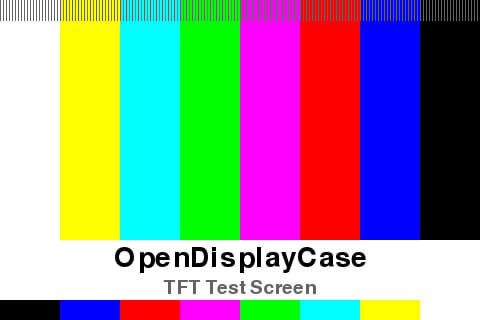
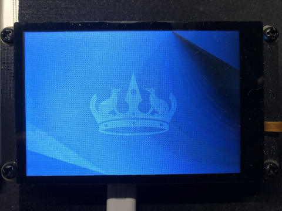
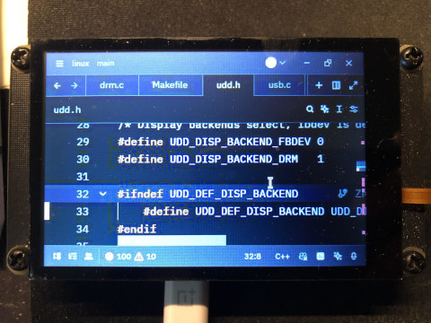
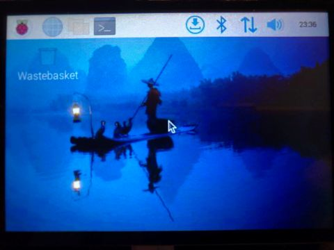

# Pico DM QD3503728 UDD

> [!WARNING]
> 本工程正处于早期开发阶段

https://github.com/user-attachments/assets/7fa16b4b-5ea4-4122-a23e-d53f6be5380d

Pico DM QD3503728 **UDD(USB Display Device)** 这个项目将树莓派Pico模拟成一个USB显示屏，
配合主机端的驱动或软件，来为主机提供显示拓展的功能。 开发本项目的初衷是为 PC 和 嵌入式板卡提供简单的显示触摸支持。

你可以在`scripts`目录下找到可用的python脚本示例，
linux驱动目前还在开发中，位于`host/linux`下，参见[主机端软件和驱动](#主机端软件和驱动)。

## 待办项

- [ ] 协议开发
- [ ] 添加一个工作流程图
- [ ] 设备端双核工作
- [ ] 更好的编解码过程
- [ ] linux 驱动输入支持
- [x] linux DRM 驱动
- [ ] linux 驱动 sysfs

## 特性

- 开箱即用
- 兼容 Pico 和 Pico2 核心板
- 平均 15 FPS 的刷新速率
- DRM 支持
- 开源驱动

## 构建并烧录设备端固件

> [!WARNING]
> Use at own risk!
> 为了更好的体验效果，本工程默认对Pico、Pico2核心板进行了超频。
> 如果您发现核心板无法正常工作，请尝试降低或关闭超频设置，方式详见官网文档中编译及配置章节。

### Raspberry Pi Pico (RP2040)
```bash
mkdir build && cd build
cmake .. -G Ninja
ninja
```

烧录方式二选一
```bash
# UF2
cp src/rp2040-freertos-template.uf2 /media/$USER/RPI-PP2

# CMSIS-DAP
openocd -f interface/cmsis-dap.cfg -f target/rp2040.cfg -c "adapter speed 25000" -c "program src/rp2040-freertos-template.elf verify reset; shutdown;"
```

### Raspberry Pi Pico2 (RP2350)

```bash
mkdir build-pico2 && cd build-pico2
cmake -DPICO_BOARD=pico2 .. -G Ninja
ninja
```
烧录方式二选一
```bash
# UF2
cp src/rp2040-freertos-template.uf2 /media/$USER/RP2350

# CMSIS-DAP
openocd -f interface/cmsis-dap.cfg -f target/rp2350.cfg -c "adapter speed 25000" -c "program src/rp2040-freertos-template.elf verify reset; shutdown;"
```

烧录完成后，显示模组屏幕将显示一幅默认画面, 如下图所示：



## 主机端软件和驱动

在完成上述设备固件的编译及烧录步骤后，将USB线缆连接至树莓派Pico的USB接口，此时电脑会识别到一个新的USB设备，
在Ubuntu上可用`lsusb`命令查看
```bash
Bus 001 Device 039: ID 2e8a:0001 embeddedboys USB Display
```

### Python脚本

安装前置Python库
```
sudo pip3 install pyusb
sudo apt install python3-opencv
```

您可能需要调整脚本中的`JPEG_QUALITY`参数来确保正常运行。

1. 测试 JPG 图片显示

```bash
sudo ./scripts/jpg_viewer.py ~/Pictures/pico_dm_yt350s006.jpg
```

2. 测试 MP4 视频播放

```bash
sudo ./scripts/mp4_player.py ~/Downloads/行走的高原大米饭，鼠兔.mp4
```

> 受限于设备性能，建议您将视频帧率降低至 `15 FPS` 以获得更流畅的效果

### Linux DRM 驱动

DRM 驱动接口随着内核版本的更新而不断变化，所以本仓库中的驱动仅以测试环境中的配置为准。
后期考虑将linux驱动单独拿出来另开一个仓库，针对一些主流发行版的LTS版本按分支进行适配。

| 测试环境 | |
| --- | --- |
| OS | Ubuntu 24.04.1 LTS |
| 设备 | X86 PC |
| 内核版本 | 6.8 |

DRM 驱动测试通过的发行版（桌面环境）：

- Ubuntu 24.04.1 LTS (Gnome)
- xubuntu 24.04 (xfce4)
- lubuntu 24.04 (LXQT)

未通过的：

- Linux mint 22.1 (Cinnamon)
- Manjaro 24.2.1 (KDE)

> [!WARNING]
> 测试通过的标准是：连接设备并加载驱动后，系统是否能够检测到新的显示器且副屏可以正常显示内容

你可能需要先安装这些软件包：
```bash
sudo apt install git make gcc -y
```

将设备连接至PC后，编译并安装驱动
```bash
cd host/linux
make clean
make
sudo insmod udd.ko
```

如果一切正常，可通过`dmesg`命令查看到内核打印的如下日志：
```bash
[ 2027.415329]

               udd_drm_setup
[ 2027.415332] udd-drm: udd_drm_alloc
[ 2027.415378] udd-drm: udd_drm_dev_init
[ 2027.415379] udd-drm: udd_drm_dev_init_with_formats
[ 2027.415477] udd-drm: mode: 480x320
[ 2027.432216] udd-drm: udd_drm_register
[ 2027.432718] [drm] Initialized udd-drm 1.0.0 for 1-4:1.0 on minor 0
[ 2027.432757] udd-drm: udd_drm_pipe_mode_valid, rc: 0
[ 2027.432996] fbcon: Deferring console take-over
[ 2027.433001] udd 1-4:1.0: [drm] fb1: udd-drmdrmfb frame buffer device
[ 2027.433063] usbcore: registered new interface driver udd
```

此时，系统应该识别到了一个新的显示器，看起来应该是这样：


新显示器的默认位置通常位于您当前屏幕的右上侧，现在可以尝试将窗口拖动到显示模组上。


DRM 驱动支持显示器热插拔功能。 您可通过在副屏运行的过程中复位Pico核心板，或者重新插拔USB线来测试热插拔功能。

### Linux fbdev 驱动

| 测试环境 | |
| --- | --- |
| OS | Ubuntu 24.04.1 LTS |
| 设备 | X86 PC |
| 内核版本 | 6.8 |

#### 编译、安装驱动

修改显示后端为 FBDEV
```diff
diff --git a/host/linux/udd.h b/host/linux/udd.h
index 76327b9..7924407 100644
--- a/host/linux/udd.h
+++ b/host/linux/udd.h
@@ -31,7 +31,7 @@
 #define UDD_DISP_BACKEND_DRM   1

 #ifndef UDD_DEF_DISP_BACKEND
-    #define UDD_DEF_DISP_BACKEND UDD_DISP_BACKEND_DRM
+    #define UDD_DEF_DISP_BACKEND UDD_DISP_BACKEND_FBDEV
 #endif
```

将设备连接至PC后，编译并安装驱动
```bash
cd host/linux
make clean
make
sudo insmod udd.ko
```

如果一切正常，可通过`dmesg`命令查看到内核打印的如下日志：
```bash
[11431.830214]

               udd_probe
[11431.830215] udd-fb: udd_framebuffer_alloc
[11431.830216] udd-fb: vmem_size: 307200
[11431.847831] 300 KB video memory
[11431.847856] usbcore: registered new interface driver udd
```

将当前用户添加进 `video` 组，您可能需要注销或者重启系统才能生效。
```bash
sudo usermod -a -G video $LOGNAME
```

#### fbterm 测试

你可能需要先安装fbterm
```bash
sudo apt install fbterm -y
```

安装完成后，使用 `Ctrl+Alt+F1` 键，进入虚拟终端tty1，使用 `Ctrl+Alt+F7` 返回桌面环境。请记住这两个快捷键之后，再进行后续操作。

假设你已经切换到了tty1，输入如下命令，将 fbterm 映射到`/dev/fb1`上。对于一些没有默认显示设备的 linux 开发板，可能为 `/dev/fb0`
```bash
FRAMEBUFFER=/dev/fb1 fbterm
```

此时您应该可以看到控制台出现在了显示模组上，然后您可以通过键盘输入字符、命令等。

#### lv_port_linux 测试

```bash
# 拉取代码
git clone https://github.com/lvgl/lv_port_linux.git

# 编译
cd lv_port_linux
mkdir build && cd build
ninja

# 运行
LV_LINUX_FBDEV_DEVICE=/dev/fb1 ../bin/lvglsim
```

#### 树莓派 Xorg server

| 测试环境 | |
| --- | --- |
| OS | Raspberry Pi OS Bookworm |
| 设备 | Raspberry Pi 5 |
| 内核版本 | 6.6.62 |

1. 将显示服务器切换到 Xorg，并重启

```bash
sudo raspi-config
```

找到 `6 Advanced Options`, 回车进入，再找到 `A6 Wayland`，回车进入后方向键上下选择 `W1 X11`，
然后按回车，出现弹窗提示已激活后，按回车返回主菜单， 最后，按 `TAB` 键切换到 `Finish` 选项，会
出现弹窗提示`Would you like to reboot now?`，默认选项`Yes`，回车重启系统。

2. 将 `99-fbdev.conf` 拷贝至 `/usr/share/X11/xorg.conf.d/` 下
```bash
cd host/linux
sudo cp 99-fbdev.conf /usr/share/X11/xorg.conf.d/
```

3. 修改显示后端为 FBDEV
```diff
diff --git a/host/linux/udd.h b/host/linux/udd.h
index 76327b9..7924407 100644
--- a/host/linux/udd.h
+++ b/host/linux/udd.h
@@ -31,7 +31,7 @@
 #define UDD_DISP_BACKEND_DRM   1

 #ifndef UDD_DEF_DISP_BACKEND
-    #define UDD_DEF_DISP_BACKEND UDD_DISP_BACKEND_DRM
+    #define UDD_DEF_DISP_BACKEND UDD_DISP_BACKEND_FBDEV
 #endif
```

4. 编译、加载 `udd` 驱动
```bash
make clean
make PLATFORM=rpi
sudo insmod udd.ko
```

5. 等待 Xorg 显示初始化完成，屏幕显示出树莓派桌面，如下图所示：



#### 卸载驱动

在执行其他python脚本前，您应当先卸载此驱动程序

卸载驱动前，请先退出所有正在使用fbdev的应用，然后尝试执行如下命令
```bash
sudo rmmod udd
```
如果提示驱动正在使用中，说明驱动不支持动态卸载。

### Windows 驱动

我不是 Windows 驱动开发人员，这可能需要一些时间。。。

## 开发

### 软件结构

[./notes/UDD.xmind](./notes/UDD.xmind)

### 协议

[./notes/protocal.md](./notes/protocal.md)

## 本项目使用的开源软件

- [FreeRTOS-Kernel](https://github.com/FreeRTOS/FreeRTOS-Kernel)
- [bitbank2/JPEGENC](https://github.com/bitbank2/JPEGENC)
- [dgatf/usb_library_rp2040](https://github.com/dgatf/usb_library_rp2040)
- [Bodmer/TJpg_Decoder](https://github.com/Bodmer/TJpg_Decoder)
- [embeddedboys/pico_dm_qd3503728_freertos](https://github.com/embeddedboys/pico_dm_qd3503728_freertos)
